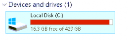
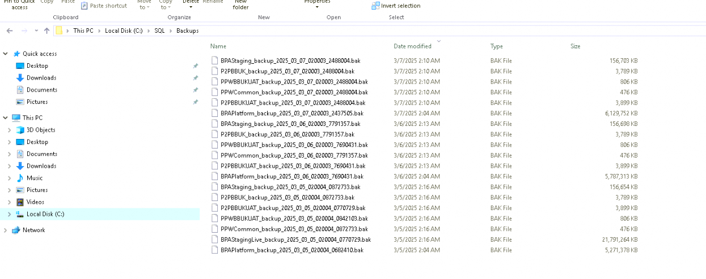
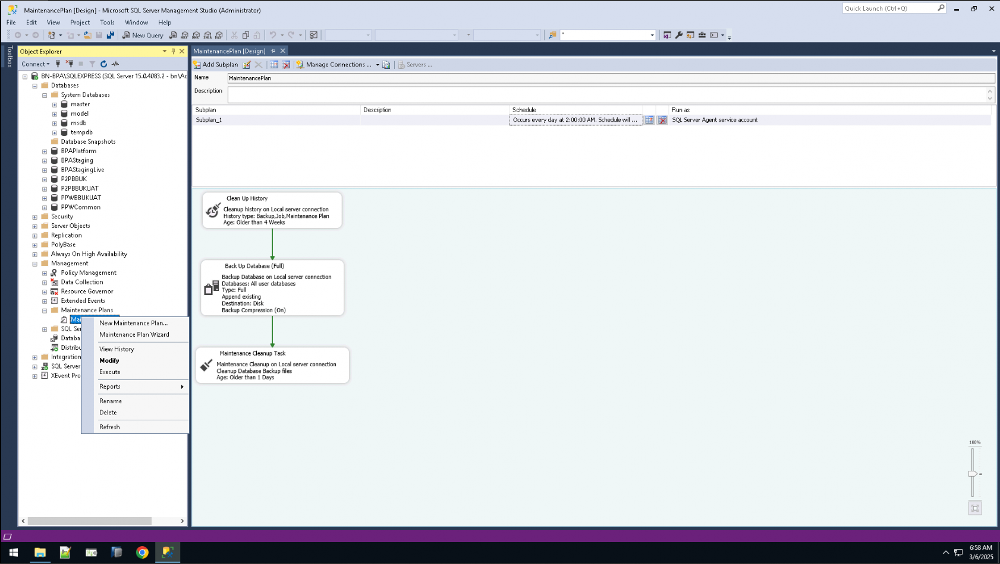
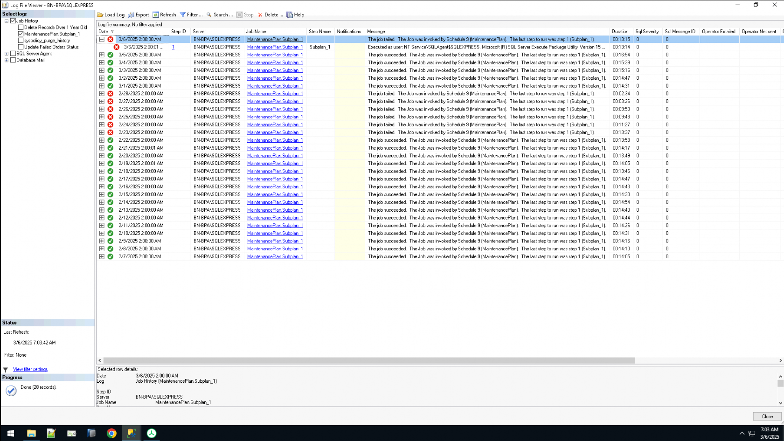
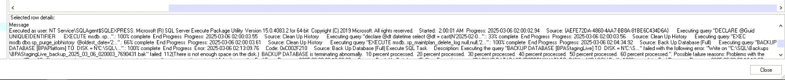
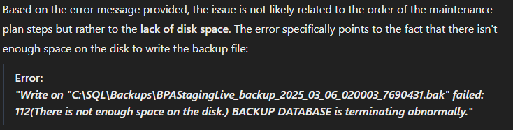
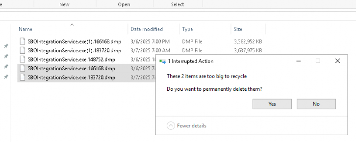

# Investigation of SQL Maintenance Plan Failure

## Overview
The SQL Maintenance Plan was failing due to insufficient disk space on the C: drive, which resulted in backups not being deleted, causing rapid disk space consumption. The investigation led to identifying several issues with the configuration and environment, which were then addressed.

One day, the disk space flagged at 8 GB of storage. I cleared temporary files, cleared the bin, etc., and there was 16 GB of free space.

I escalated the matter to the SAP Team to remove any other unnecessary files to further clear up space. However, the next day, the space decreased to 4GB of free space.

At the time, I wasn not aware that this was due to the backup files from the previous day not deleting. This required me to manually clear up space and remove the backups.

---

## 1. Identifying the Core Issue

The investigation began by reviewing the SQL Maintenance Plan and the job history. The primary issue was that the maintenance plan kept failing because there was **not enough disk space** to perform backups. The plan could not delete old backups, causing the disk to quickly fill up.

I investigated the issue by viewing the job history in **SQL Server Management Studio (SSMS)**.

The job history shows that the Maintenance plan failed today at 2 AM.

---

## 2. Understanding the Configuration Problem

Upon further analysis, it was discovered that the company was using a **single disk (C: drive)** for both SQL Server data and backups. This practice is problematic because:
- **No redundancy**: Backups should be stored on a separate disk for better availability and disaster recovery.
- **Disk contention**: Storing both databases and backups on the same disk leads to performance issues and space-related failures.

---

## 3. Reviewing SQL Server Maintenance Plan

The maintenance plan was set up in **SQL Server Management Studio (SSMS)**. Despite the correct configuration, it was found that:
- The **Backup Cleanup Task** was not executed before the backup task.
- As a result, old backup files were not deleted, causing disk space to be consumed rapidly.

---

## 4. Investigating the Error

The error logs showed that the backup task failed due to a lack of space on the **C:\SQL\Backups** directory. The error code **112** was recorded, indicating that the disk was full or nearly full.

---

## 5. Impact Analysis

The failure to execute the backups had the following consequences:
- Backup tasks for databases like **[BPAStagingLive]** failed, leading to **incomplete or missing backups**.
- This posed a risk of **data loss or inconsistency** within the system.

---

## 6. Space Recovery and Collaboration

The server was running out of space, with only **16 GB** available. To resolve this:
- I collaborated with **Mr. Eames** (senior resource) to identify files that could be deleted to free up space.
- We removed **duplicate .dmp files** that were not essential for operations, which cleared up space for the backups to proceed.

---

## 7. Monitoring and Final Resolution

After freeing up sufficient space, I monitored the SQL Maintenance Plan's execution. The subsequent plan execution was successful, and the backups were completed without errors.

---

## Conclusion

The issue was caused by a combination of disk space limitations and the configuration of the maintenance plan. By freeing up disk space, the plan was able to run successfully. Going forward, I recommend implementing a more robust storage solution with backups on a separate disk or off-site to prevent similar issues.

For more information on the solutions implemented, see the [solutions.md](solution.md).
