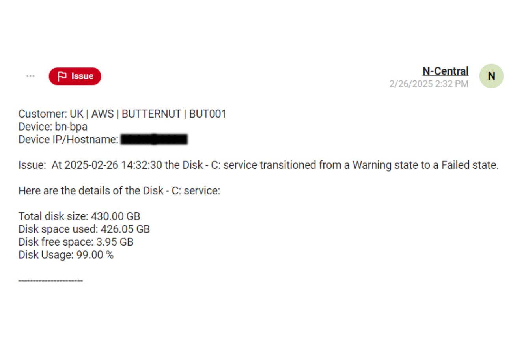

# Issues Identified in SQL Server Backup & Maintenance Project

## Overview

During the investigation of the SQL Server backup and maintenance failures at **Butternut Box**, several critical issues were identified that impacted the performance and reliability of the system. These issues directly contributed to the recurring backup failures, disk space problems, and an overall lack of resilience in the infrastructure.

This document outlines the issues discovered, their impact on the system, and the steps taken to resolve them.

## Disk Alert Service Ticket

## Key Issues

### 1. **Insufficient Disk Space**
The most critical issue was that the C: drive, which stored both the SQL Server database and its backups, had insufficient space. The disk became full, causing backup failures and preventing the successful execution of maintenance tasks. This issue was exacerbated by the lack of an automatic backup cleanup task, which resulted in old backup files accumulating and consuming disk space.

**Impact:**
- Backup tasks failed daily due to lack of available space.
- SQL maintenance tasks could not complete, causing overall system instability.
- Disk contention between SQL Server and backups hindered performance.

### 2. **Backup Cleanup Failure**
The backup cleanup task, which is supposed to delete older backups, failed to execute as part of the SQL Server maintenance plan.

**Impact:**
- Old backups remained on the system, consuming valuable disk space.
- Without a retention policy in place, backup files were not regularly cleared.
- Backup storage management was inefficient, leading to disk full errors.

### 3. **Single Disk Storage Configuration**
The server had a single C: drive for both SQL Server data and backup storage. This setup did not provide the necessary separation between live database files and backup files, which led to disk contention.

**Impact:**
- The server was vulnerable to performance degradation due to resource contention.
- No redundancy or high availability for backups, increasing the risk of data loss.
- Lack of proper infrastructure planning reduced the overall system resilience.

### 4. **Lack of Backup Redundancy**
The backups were being stored on the same server as the SQL Server, with no off-site storage or redundant backup systems in place. This setup left the client vulnerable to data loss in case of hardware failure or other disasters.

**Impact:**
- If the server experienced failure, both the SQL Server data and backups would be lost.
- No disaster recovery mechanism was in place, increasing the risk of critical data loss.

### 5. **No Backup Retention Policy**
The SQL maintenance plan did not have a proper backup retention policy. There was no automated system to delete backups older than a certain period, leading to an accumulation of outdated backup files.

**Impact:**
- Unmanaged growth of backup files contributed to storage limitations.
- Without a retention policy, it was impossible to keep track of backup history effectively.

## Actions Taken to Address Issues

The following actions were taken to resolve the identified issues:

### 1. **Freeing Disk Space**
Manual deletion of redundant **.dmp** files and other unnecessary data was performed to free up space and allow backups to run.

### 2. **Implementation of SQL Maintenance Plan**
A SQL Maintenance Plan was set up to automatically delete backups older than 24 hours, ensuring that old data does not accumulate and consume unnecessary space.

### 3. **Storage Configuration Changes**
A recommendation was made to move backups off the C: drive to separate drives (D: and E:) to improve storage management and prevent disk contention between SQL Server data and backups.

### 4. **Implementation of Off-Site Backup Storage**
A migration plan was initiated to move backups off the server and into cloud-based storage, ensuring data redundancy and disaster recovery.

## Results

After addressing these issues, the backups ran successfully, and disk space problems were resolved. The overall system performance improved, and the risk of data loss was greatly reduced due to improved infrastructure and the implementation of best practices.

Please refer to the [Investigation Page](investigation.md) for the process as to how I troubleshooted the issue and detailed internal notes of the investigation process.
