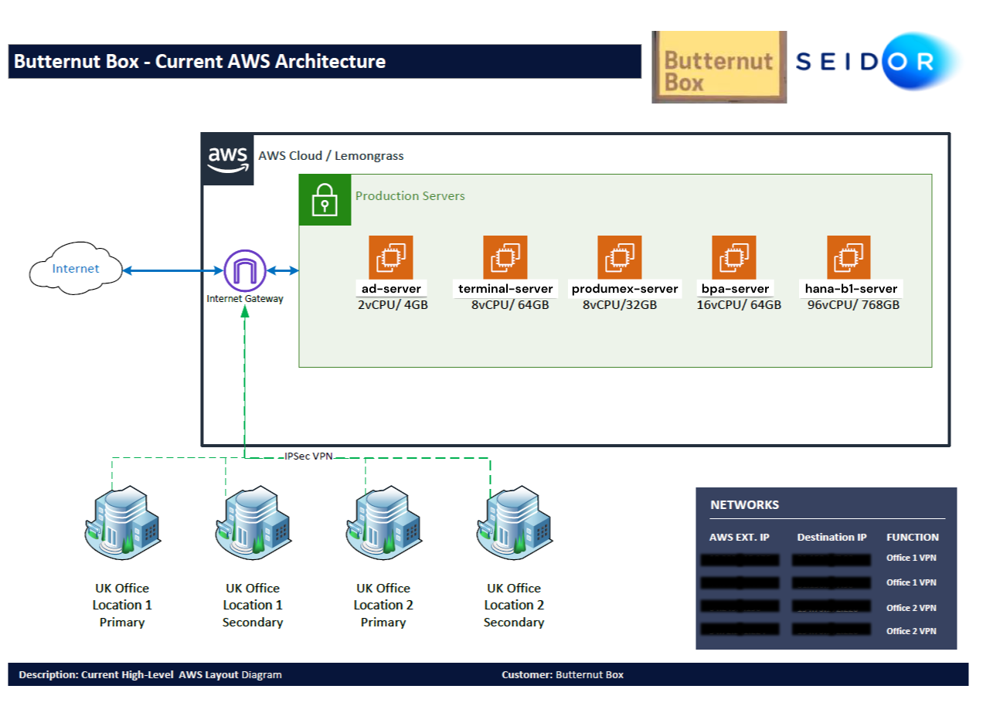
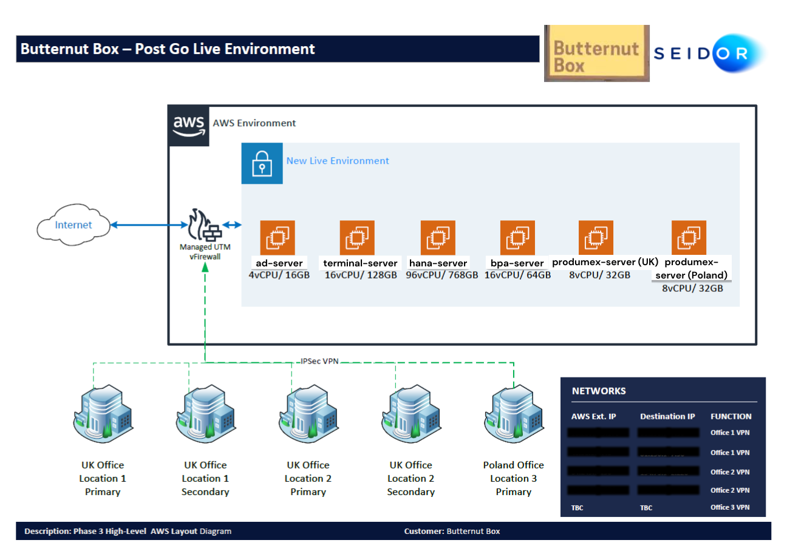

# Migration Plan for Backup Solution Upgrade

## Overview

To prevent future backup issues and enhance the scalability, availability, and disaster recovery of our backup solutions, we have developed a comprehensive migration plan. The solution transitions our current backup system for Butternut Box to a dedicated, high-availability, AWS-hosted backup architecture. This migration aims to ensure that backups are more resilient, can scale to accommodate growth, and provide better disaster recovery capabilities.

### Objectives:
- **Move backups to a separate, dedicated backup server or cloud-based storage (AWS S3).**
- **Implement redundancy to ensure high availability and disaster recovery.**
- **Ensure easy scalability to meet future demands.**

## Current Architecture (Butternut Box)

### AWS Infrastructure Overview:
Currently, the architecture includes several EC2 instances running in a Virtual Private Cloud (VPC) designed to handle production, staging, and office connectivity requirements.

- **Production Servers:**
  - **ad-server**: 2 vCPUs / 4GB
  - **terminal-server**: 8 vCPUs / 64GB
  - **produmex-server**: 8 vCPUs / 32GB
  - **bpa-server**: 16 vCPUs / 64GB
  - **hana-b1-server**: 96 vCPUs / 768GB
  
- **VPC Configuration:**
  - These servers are connected to UK offices (Location 1 and Location 2) using an **IPSec VPN** and **Internet Gateway**.
  
- **Internet Connectivity:**
  - EC2 instances are connected to the internet through the **Internet Gateway** and can access internal office resources through the VPN.

### Backup Challenges:
The current backup system does not provide redundancy, scalability, or proper disaster recovery mechanisms, leading to occasional issues with backup availability, space management, and recovery time in case of failure.

---

## Phase 2: Go-Live Readiness Environment

### Migration Plan Overview:
In the next phase, we will transition to a more robust backup solution that ensures data security, availability, and high availability for disaster recovery. This will involve moving the backups to a **cloud-based backup solution** and leveraging AWS services like **S3** and **Glacier** for long-term backup storage.

### Current Infrastructure:
1. **Production Servers:**
   - **ad-server**: 2 vCPUs / 4GB EC2
   - **terminal-server**: 8 vCPUs / 64GB EC2
   - **produmex-server**: 8 vCPUs / 32GB EC2
   - **bpa-server**: 16 vCPUs / 64GB EC2
   - **hana-b1-server**: 96 vCPUs / 512GB EC2

2. **Staging/New Live Servers (Upgrade Testing):**
   - **Terminal Server**: 4 vCPUs / 32GB EC2
   - **HANA Server**: 32 vCPUs / 256GB EC2
   - **Produmex UK**: 8 vCPUs / 32GB EC2
   - **Produmex Poland**: 8 vCPUs / 32GB EC2

   These servers will serve as **test and upgrade staging** environments. The upgrade testing will run 24x7 to simulate production environments and verify backup performance during critical operations.

   

### Backup Solution Transition:
- **Backup Migration to AWS S3**: Move backup storage to **AWS S3** for scalable, secure, and cost-effective cloud-based backup storage.
  - **Lifecycle Policies**: Implement S3 lifecycle policies to automatically move older backups to **S3 Glacier** for long-term storage at a lower cost.
  
- **Redundancy and High Availability**: 
  - **Multi-AZ Replication**: Ensure that backups are replicated across multiple Availability Zones (AZs) for high availability and disaster recovery.
  - **AWS Backup**: Utilize **AWS Backup** to centralize backup management across multiple AWS services, ensuring consistency, scheduling, and retention policies.
  
- **Automated Backup Scheduling**:
  - Implement automated backup jobs via **AWS Lambda** and **AWS Backup** to ensure backups are created consistently without manual intervention.

---

## Post-Go-Live Environment (Production)

### Final Production Servers:
- **ad-server**: 4 vCPUs / 16GB EC2
- **terminal-server**: 16 vCPUs / 128GB EC2
- **hana-b1-server**: 32 vCPUs / 768GB EC2
- **produmex-uk**: 8 vCPUs / 32GB EC2
- **produmex-poland**: 8 vCPUs / 32GB EC2

### Connectivity and Security:
- **VPC Connectivity**:
  - Post-migration, all production and backup servers will be part of a **highly available AWS VPC** connected to UK offices (Location 1 & 2) and Poland office (Location 3).
  - Secure connections will be established via a **Managed UTM vFirewall** and **IPSec VPN** ensuring data integrity and security.
  
- **Internet Connectivity**:
  - EC2 instances will be connected to the internet and will access AWS services securely via **PrivateLink** and **Internet Gateway**.

### Backup and Disaster Recovery:
- **Automated Backup Storage**: Backups will be automatically stored in **S3** and archived in **Glacier** based on the backup retention policy.
- **Replication Across Regions**: Backup data will be replicated across **multiple regions** (e.g., UK and Poland) to ensure that disaster recovery is achievable even in case of regional AWS service disruptions.

---

## Migration Timeline

| Phase                        | Task                                        | Estimated Time | Dependencies               |
|------------------------------|---------------------------------------------|----------------|----------------------------|
| **Phase 1**                  | Backup to S3 Setup                         | 3 weeks         | None                       |
| **Phase 2**                  | AWS Backup Implementation and Testing      | 4 weeks         | Phase 1                    |
| **Phase 3**                  | Full Go-Live Migration to Cloud-based Backup| 2 weeks        | Phase 2                    |
| **Post-Go-Live**             | Monitoring and Backup Retention Policies    | Ongoing        | Phase 3                    |

---

## AWS Services for Backup Solution

1. **AWS S3 (Simple Storage Service)**:
   - Scalable and secure storage for backup data.
   - Supports lifecycle policies for archiving older backups to **S3 Glacier**.

2. **AWS Backup**:
   - Centralized backup service that automates and manages backup schedules, retention policies, and restoration tasks.

3. **AWS Lambda**:
   - Automates backup tasks and integrates with other AWS services for seamless operations.

4. **Amazon Glacier**:
   - Long-term storage for older backups to reduce costs without sacrificing data availability.

5. **AWS CloudFormation**:
   - Used to automate the infrastructure provisioning, ensuring consistency across backup environments.

---

## Conclusion

This migration plan outlines the necessary steps to transition the backup solution to a highly available, scalable, and cost-effective AWS environment. By leveraging AWS services such as S3, Glacier, and AWS Backup, we ensure that the backup data is securely stored, efficiently managed, and ready for disaster recovery at all times.

Post-migration, the new solution will enhance the resiliency and performance of the backup system, ensuring high availability and data protection for all critical business operations.