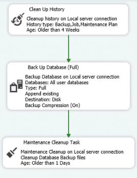

# Solutions to SQL Maintenance Plan Failure

## Overview
The SQL Maintenance Plan failure was caused by insufficient disk space, which nearly caused the server to crash. The solution involved reconfiguring the Maintenance Plan and performing manual intervention by removing the backups and `.dmp` files to free up enough space for the maintenance plan to execute successfully.

---

## 1. **SQL Maintenance Plan Steps (for Backup Retention)**

### Step 1: Clean Up History
This step removes old maintenance history data, including backup, job, and maintenance plan history entries older than 4 weeks.

**Action**: SQL Server deletes historical records older than 4 weeks to reduce clutter and improve server performance.

**Reason**: Helps maintain a clean database, optimising storage and performance by eliminating outdated data.

---

### Step 2: Back Up Database (Full)
This step performs a full backup of all user databases.

**Action**: SQL Server backs up all user databases and appends the backup to the existing file, with compression enabled to reduce file size.

**Reason**: Full backups preserve the entire database for point-in-time recovery and reduce storage requirements with compression.

---

### Step 3: Maintenance Cleanup Task
This task deletes backup files older than 1 day to free up space.

**Action**: SQL Server removes backup files that are older than 24 hours.

**Reason**: Prevents disk space from filling up with old backups, ensuring there is sufficient space for new backups and improving system efficiency.

---

## 2. **Changes Implemented**

### Adjusted Backup Cleanup Criteria
During the investigation, it was noted that the previous configuration used "older than 1 day" for backup cleanup. However, SQL Server might not recognise when a "day" passes, leading to inconsistencies. The cleanup criteria were changed to "older than 24 hours" to ensure more accurate and reliable cleanup.

**Reason for Change**: SQL Server uses a 24-hour window for file cleanup, which is more precise and ensures that backup files older than 24 hours are removed effectively.

Reference: The change aligns with the SQL Server documentation on backup retention, which recommends using a 24-hour cleanup window for better accuracy. For more details, refer to the [SQL Server Maintenance Plans documentation](https://learn.microsoft.com/en-us/sql/relational-databases/maintenance-plans/maintenance-plans?view=sql-server-ver16).

---

## 3. **Disk Space Management**

Backup files and SQL data were previously stored on the same disk, leading to space contention. To resolve this:
- Backups were moved to a separate disk to avoid filling up the primary disk.
- Unnecessary files, such as duplicate `.dmp` files, were removed to free up additional space.

---

## 4. **Reference to Migration Plan**

To further prevent similar issues, a migration plan (an AWS-hosted, high-availability, and scalable upgrade) was developed to transition backups to a dedicated backup solution. The plan includes:
- Moving backups to a separate backup server or cloud-based storage.
- Implementing redundancy to ensure availability and disaster recovery.

For more information, refer to the [migration_plan.md](migration_plan.md).